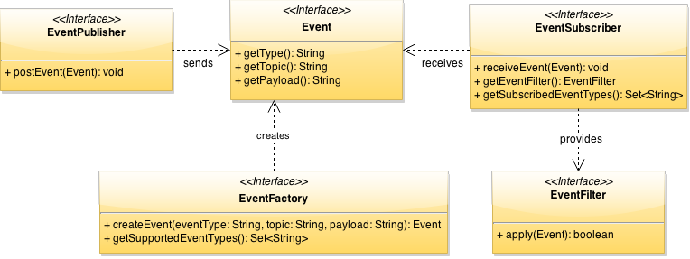

# Events

The Eclipse SmartHome framework offers to post and receive events through the SmartHome event bus in an asynchronous way. Events can be "Item added/removed/updated", "Thing added/removed/updated", "Item command sent", "Thing status changed", etc. This section shows how to post and receive such events.

## API

### The Interfaces
The following diagram introduces the interfaces of the Eclipse SmartHome event mechanism.



The `EventPublisher` posts `Event`s through the Eclipse SmartHome event bus in an asynchronous way. The `EventSubscriber` defines the callback interface to receive  events of specific types to which the event subscriber is subscribed to (`EventSubscriber.getSubscribedEventTypes()`). An event subscriber can provide an `EventFilter` in order to filter events based on the topic or the content. If there is no filter all subscribed event types are received. The event itself will be subclassed for each event type, which exists in the System (e.g. ItemCommandEvent, ItemUpdateEvent, ThingStatusInfoEvent, etc.). As for different event types different concrete classes exist, an `EventFactory` creates concrete event type instances. 

### The Events
This section lists all events provided by Eclipse SmartHome. An event has a topic, a type and a payload. The payload is serialized with JSON and is determined by its event type. Each event implementation (e.g. ItemCommandEvent, ItemUpdateEvent) provides the payload as high level methods as well. A topic clearly defines the target of the event and its structure is similar to a REST URI, except the last part, the action:

`{namespace}/{entityType}/{entity}/{action}`, e.g. `smarthome/items/{itemName}/command`

The following table lists all events, its topics and the corresponding factories.

| Event         		|Description 								 |Topic 		       				 |Factory 			|
|-----------------------|--------------------------------------------|-----------------------------------|------------------|
| ItemCommandEvent 		|A command is sent to an item via a channel. |smarthome/items/{itemName}/command |ItemEventFactory 	|
| ItemUpdateEvent 		|The status of an item is updated. 		 	 |smarthome/items/{itemName}/update  |ItemEventFactory 	|
| ThingStatusInfoEvent	|The status of a thing is updated.			 |smarthome/things/{thingUID}/status |ThingEventFactory |


## API Usage Example

### Receive Events

The following Java snippet shows how to receive `ItemUpdateEvent`s and `ItemCommandEvent`s from the event bus. Therefore, the `EventSubscriber` interface must be implemented.

```java
public class SomeItemEventSubscriber implements EventSubscriber {
    private final Set<String> subscribedEventTypes = ImmutableSet.of(ItemUpdateEvent.TYPE, ItemCommandEvent.TYPE);
    private final EventFilter eventFiter = new TopicEventFilter("smarthome/items/.*");
    
    @Override
    public Set<String> getSubscribedEventTypes() {
        return subscribedEventTypes;
    }

    @Override
	public EventFilter getEventFilter() {
		return eventFilter;
	}

    @Override
	public void receive(Event event) {
		String topic = event.getTopic();
		String type = event.getType();
		String payload = event.getPayload();
		if (event instanceof ItemCommandEvent) {
			ItemCommandEvent itemCommandEvent = (ItemCommandEvent) event;
			String itemName = itemCommandEvent.getItemName();
			Command command = itemCommandEvent.getItemCommand();
			// ...
        } else if (event instanceof ItemUpdateEvent) {
			ItemCommandEvent itemCommandEvent = (ItemCommandEvent) event;
			// ...
        }
	}
}
```
The `SomeItemEventSubscriber` is subscribed to the event types `ItemUpdateEvent` and `ItemCommandEvent`. A string representation of the event types can be obtained by a public member `TYPE` which normally presents the name of the class. The subscriber provides a topic filter with the regular expression "smarthome/items/.*". The filter method `EventFilter.apply()` will be called for each event on the event bus to which the event subscriber is subscribed to. If the filter applies, the event will be received by the `EventSubscriber.receive()` method. Received events can be casted to the event implementation class for further processing. Both - the filter and the subscribed types - should be class members and not directly returned by the corresponding methods due to performance reasons.

Each event subscriber must be registered via OSGi Declarative Services (DS) with the interface `org.eclipse.smarthome.event.EventSubscriber` as illustrated below.

```xml
<scr:component xmlns:scr="http://www.osgi.org/xmlns/scr/v1.1.0" immediate="true" name="SomeItemEventSubscriber">
   <implementation class="org.eclipse.smarthome.core.items.events.SomeItemEventSubscriber"/>
   <service>
      <provide interface="org.eclipse.smarthome.core.events.EventSubscriber"/>
   </service>
</scr:component>
```  

### Send Events

The Java snippet below illustrates how to send events, e.g. `ItemCommandEvent`s. To create an event the corresponding event factory must be used.
```java 
EventPublisher eventPublisher; 

ItemCommandEvent itemCommandEvent = ItemEventFactory.createCommandEvent("TheItemName", OnOffType.ON);
eventPublisher.postEvent(itemCommandEvent);
```

The EventPublisher will be injected via OSGi Declarative Services.

```xml
<scr:component xmlns:scr="http://www.osgi.org/xmlns/scr/v1.1.0" immediate="true" name="SomeComponentWantsToPublish">
	<!-- ... -->
   <reference bind="setEventPublisher" cardinality="1..1" interface="org.eclipse.smarthome.core.events.EventPublisher" 
   		name="EventPublisher" policy="static" unbind="unsetEventPublisher"/>
</scr:component>
```